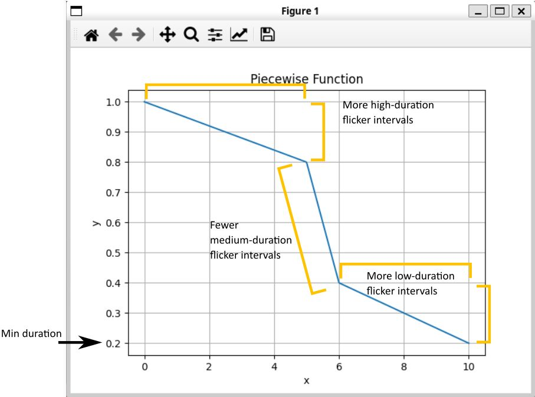

Super early stage project
----
This is a project to make a flickering LED strip.

I wanted it to be a non-static pattern of flickers, but also felt that a uniform randomness wouldn't make sense.

I started off theorizing that I'd have a mix of long and short flicker durations, with fewer in the middle, to make the effect's flciker durations noticeably non-uniform.

To do this, I made a probability distribution function (PDF) and plotted it.  The above ideas are annotated on the PDF below:

# ws-2812
See ws2812-demo/README.md
