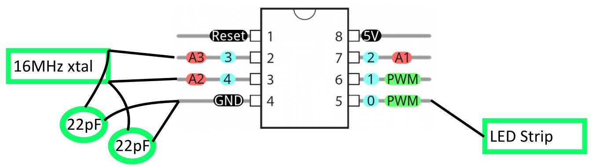

Info
----
This is a much simpler implementation of using ws2812 LEDs with an ATTiny85, greatly
simplifying what I did years ago with Webbotlib (https://github.com/erelson/SinkLightViaLimitSwitch).
This version should be a lot simpler to get working again, years from now.

After installing the `gcc-avr` library and `avrdude`:
```
make
make fuse   # once per ATTiny85 to do initial setup
make flash
```


Notes
-----
Includes a older version of [this ws2812 library](https://github.com/cpldcpu/light_ws2812/tree/master/light_ws2812_AVR/Light_WS2812).
I didn't look into the updates or test the newer version.

Running at 16 MHz. Slowest startup time.


Example wiring:




Due to vagaries of my single-evening setup session in 9-2023:
- In Ubuntu (WSL2) Installed `avrdude gcc-avr avr-libc` (and some other stuf that was pulled in probably)
- Followed Sparkfun's guide to use Windows Device Manager to install the libusb-win32 
- WSL2 wasn't set up to be able to see the Sparkfun Tiny Programmer...
- So I installed winavr + `avrdude` in Windows directly, and ran `avrdude` in `cmd`, and flashing works.


For color temperature... A good white might be e.g. 4000 K.

This link loosely shoots for that:
https://meistergedanke.de/2017/letting-ws2812-leds-shine-warm-white/286

It suggests 255,160,140, or with a weaker power supply, 255,140,140

My setup
----

Using a 140 WS2812 LEDs

Powering chain: Wall AC -> Ubiquity PoE injector -> 5V PoE Splitter -> LEDs + Attiny85

The PoE injector talks about outputing 0.5 A at 48V, so limit is 24W of power.

My initial tests were at 

- setAllLEDs(40, 40, 15);

Kill-a-watt said this was at about 5 W

Tried next 153, 96, 84  (60%)

- This gave 16 W (initially 17 W)

Opting to go to 75%, to hit about 20W maybe:

- 191,120,105

This gave about 21 W usage
