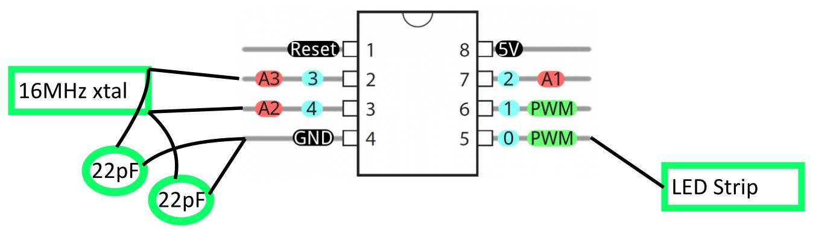

Info
----
This is a much simpler implementation of using ws2812 LEDs with an ATTiny85, greatly
simplifying what I did years ago with Webbotlib (https://github.com/erelson/SinkLightViaLimitSwitch).
This version should be a lot simpler to get working again, years from now.

After installing the `gcc-avr` library and `avrdude`:
```
make
make fuse   # once per ATTiny85 to do initial setup
make size   # see how much of the ATTiny85 storage/ram is used by the code
make flash
```


Notes
-----
Includes a older version of [this ws2812 library](https://github.com/cpldcpu/light_ws2812/tree/master/light_ws2812_AVR/Light_WS2812).
I didn't look into the updates or test the newer version.

Fuse setup notes: Running at 16 MHz. Slowest startup time.

Example wiring:




My setup
----

Using a 140 WS2812 LEDs

Powering chain: 5V -> LEDs + Attiny85
